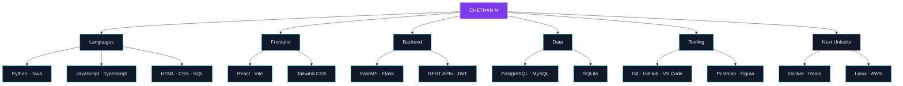

<!--
  ╔══════════════════════════════════════════════════════════════════════╗
  ║  CHETHAN N · GITHUB PROFILE                                         ║
  ║  Original interface concept: "The Engineer's System Window"         ║
  ║  Palette: Void / Purple / Cyan                                      ║
  ╚══════════════════════════════════════════════════════════════════════╝

  QUICK SETUP
  1. Keep this file in the root of the public repository chevior/chevior.
  2. Keep assets/system-banner.svg in the same repository.
  3. Keep .github/workflows/snake.yml to generate the contribution snake.
  4. Replace the LinkedIn placeholder in the Connect section when ready.
  5. Replace the email only if nchethan066@gmail.com changes.

  All public project links below were matched to existing repositories.
  Stock Price Predictor and Spam Email Classifier are presented as roadmap
  builds because those repositories are not public on this account yet.
-->

<div align="center">

<a href="https://github.com/chevior">
  
</a>

<br />

<!-- Animated typing header — edit the phrases after `lines=` if desired. -->
<a href="https://git.io/typing-svg">
  
</a>

<br />

<a href="https://github.com/chevior?tab=followers">
  
</a>
<a href="https://github.com/chevior?tab=repositories">
  
</a>


</div>

<!-- ==================================================================== -->
<!-- 01 / PROFILE                                                         -->
<!-- ==================================================================== -->

## `01 // PLAYER PROFILE`

<table width="100%">
<tr>
<td width="62%" valign="top">

### Hello, I'm Chethan N.

I'm an **Information Science Engineering student** and **full-stack developer**
from Bengaluru, India. I enjoy turning complex requirements into reliable,
well-structured products—with a particular interest in Python, backend systems,
APIs, data, and applied AI.

My work is driven by a simple standard: build software that is useful outside
the demo. That means thoughtful architecture, clear interfaces, secure defaults,
maintainable code, and a product experience people can trust.

```python
class Chethan:
    role = "Information Science Engineering Student"
    path = ["Full Stack", "Python", "Backend", "Applied AI"]
    location = "Bengaluru, India"
    current_goal = "Become a Software Engineer"

    def daily_loop(self):
        return ("learn", "build", "test", "ship", "improve")
```

</td>
<td width="38%" valign="top">

### `STATUS WINDOW`

```text
╭─────────────────────────────╮
│ IDENTITY      CHETHAN N      │
│ CLASS         DEVELOPER      │
│ SPECIALTY     BACKEND        │
│ DOMAIN        FULL STACK     │
│ ALIGNMENT     PRODUCT        │
│ BASE          BENGALURU      │
├─────────────────────────────┤
│ BUILD MODE    ACTIVE         │
│ CURIOSITY     MAX            │
│ CONSISTENCY   LOADING...     │
│ NEXT RANK     SDE            │
╰─────────────────────────────╯
```

</td>
</tr>
</table>

> **Current objective** — grow into a software engineer who can own a feature
> from architecture and APIs to polished user experience and production delivery.

<!-- ==================================================================== -->
<!-- 02 / DEVELOPER STATUS                                                -->
<!-- ==================================================================== -->

## `02 // DEVELOPER STATUS`

<div align="center">

| SYSTEM | SIGNAL | CURRENT STATE |
|:--|:--:|:--|
| **Primary build stack** | `ONLINE` | Python · FastAPI · Flask · React · TypeScript |
| **Engineering bias** | `BACKEND` | APIs · auth · data modeling · reliable business logic |
| **Product mode** | `ACTIVE` | Building complete workflows, not isolated demos |
| **AI track** | `LEARNING` | Practical ML systems and intelligent developer experiences |
| **Career mission** | `LOCKED` | Software Engineer |

</div>

```text
SYSTEM LOG
──────────────────────────────────────────────────────────────────────────
[READY]   Translate product requirements into maintainable software
[READY]   Design and consume REST APIs
[READY]   Build modern React interfaces
[ACTIVE]  Deepen backend architecture and production engineering
[ACTIVE]  Learn infrastructure, caching, containers, Linux, and cloud
[NEXT]    Contribute consistently to open-source projects
──────────────────────────────────────────────────────────────────────────
```

<!-- ==================================================================== -->
<!-- 03 / SKILL TREE                                                      -->
<!-- ==================================================================== -->

## `03 // SKILL TREE`



<!-- GitHub supports Mermaid diagrams natively. If your renderer does not,
     the Tech Stack section below remains a complete accessible fallback. -->

<!-- ==================================================================== -->
<!-- 04 / TECH ARSENAL                                                    -->
<!-- ==================================================================== -->

## `04 // TECH ARSENAL`

<div align="center">

### Languages

<p>
  
  &nbsp;
  
  &nbsp;
  
  &nbsp;
  
  &nbsp;
  
  &nbsp;
  
  &nbsp;
  
</p>


### Frontend

<p>
  
  &nbsp;
  
  &nbsp;
  
</p>


### Backend

<p>
  
  &nbsp;
  
</p>


### Databases

<p>
  
  &nbsp;
  
  &nbsp;
  
</p>


### Tools

<p>
  
  &nbsp;
  
  &nbsp;
  
  &nbsp;
  
  &nbsp;
  
</p>


### Learning Queue

<p>
  
  &nbsp;
  
  &nbsp;
  
  &nbsp;
  
</p>


</div>

<!-- ==================================================================== -->
<!-- 05 / FEATURED BUILDS                                                 -->
<!-- ==================================================================== -->

## `05 // FEATURED BUILDS`

<table width="100%">
<tr>
<td width="50%" valign="top">

### ☁️ FileHub

**Personal Cloud Storage Platform**

A full-stack storage workspace designed around secure authentication,
structured file operations, and a clean modern interface.

`FastAPI` · `React` · `TypeScript` · `PostgreSQL` · `JWT`

[](https://github.com/chevior/FileHub)

</td>
<td width="50%" valign="top">

### 🎬 CineVerseX

**Movie Booking Platform**

A complete cinema discovery and booking experience with authentication,
movie data, ticket workflows, and production-minded application structure.

`Python` · `Flask` · `MySQL` · `TMDB API`

[](https://github.com/chevior/CineVerseX)

</td>
</tr>
<tr>
<td width="50%" valign="top">

### 📄 AI Resume Analyzer

**AI-Assisted Career Intelligence Platform**

A full-stack analyzer for ATS scoring, skill extraction, resume feedback,
and actionable job-readiness insights.

`Python` · `Flask` · `React` · `Applied AI`

[](https://github.com/chevior/AI-Resume-Analyzer)

</td>
<td width="50%" valign="top">

### 🧠 Applied ML Lab

**Prediction & Classification Projects**

Building practical machine-learning workflows through a **Stock Price
Predictor** and **Spam Email Classifier**, from data preparation to evaluation.

`Python` · `Machine Learning` · `Data Analysis`


</td>
</tr>
</table>

<!-- The two ML projects do not currently have public repositories.
     Replace their status badge with repository links after publishing them. -->

<div align="center">

[](https://github.com/chevior/FileHub)
[](https://github.com/chevior/CineVerseX)

[](https://github.com/chevior/AI-Resume-Analyzer)

</div>

<!-- ==================================================================== -->
<!-- 06 / GITHUB TELEMETRY                                                -->
<!-- ==================================================================== -->

## `06 // GITHUB TELEMETRY`

<div align="center">

<!-- GitHub Stats -->
<picture>
  <source
    media="(prefers-color-scheme: dark)"
    srcset="https://github-readme-stats.vercel.app/api?username=chevior&show_icons=true&include_all_commits=true&count_private=false&hide_border=false&border_color=312e81&bg_color=0b1020&title_color=a78bfa&text_color=cbd5e1&icon_color=22d3ee&rank_icon=github"
  />
  
</picture>

<!-- Top Languages: language size, not proficiency. -->
<picture>
  <source
    media="(prefers-color-scheme: dark)"
    srcset="https://github-readme-stats.vercel.app/api/top-langs/?username=chevior&layout=compact&langs_count=8&hide_border=false&border_color=164e63&bg_color=0b1020&title_color=67e8f9&text_color=cbd5e1"
  />
  
</picture>

<br />
<br />

<!-- GitHub Streak -->
<picture>
  <source
    media="(prefers-color-scheme: dark)"
    srcset="https://github-readme-streak-stats.herokuapp.com?user=chevior&hide_border=false&border=312E81&background=0B1020&ring=A78BFA&fire=22D3EE&currStreakLabel=67E8F9&sideLabels=CBD5E1&currStreakNum=F8FAFC&sideNums=F8FAFC&dates=64748B"
  />
  
</picture>

</div>

<!-- ==================================================================== -->
<!-- 07 / ACTIVITY GRAPH                                                  -->
<!-- ==================================================================== -->

## `07 // CONTRIBUTION MATRIX`

<div align="center">

<!-- Contribution Graph -->
[](https://github.com/chevior)

<!-- Contribution Snake: generated by .github/workflows/snake.yml.
     It appears after the workflow runs once and creates the output branch. -->
<picture>
  <source
    media="(prefers-color-scheme: dark)"
    srcset="https://raw.githubusercontent.com/chevior/chevior/output/github-contribution-grid-snake-dark.svg"
  />
  
</picture>

</div>

<!-- ==================================================================== -->
<!-- 08 / TROPHY ARCHIVE                                                  -->
<!-- ==================================================================== -->

## `08 // ACHIEVEMENT ARCHIVE`

<div align="center">

<!-- GitHub Trophies -->
[](https://github.com/ryo-ma/github-profile-trophy)

</div>

<!-- ==================================================================== -->
<!-- 09 / DEVELOPER JOURNEY                                               -->
<!-- ==================================================================== -->

## `09 // DEVELOPER JOURNEY`

```text
01  FOUNDATION
    └─ Learned programming fundamentals through Python and Java
       └─ Built comfort with logic, data structures, and problem solving

02  WEB SYSTEMS
    └─ Moved from static pages into full-stack development
       └─ Connected frontend experiences to backend logic and databases

03  PRODUCT BUILDS
    └─ Created FileHub, CineVerseX, and AI Resume Analyzer
       └─ Focused on complete workflows: auth, APIs, data, and UI

04  ENGINEERING DEPTH                    ◀ CURRENT CHECKPOINT
    └─ Strengthening architecture, testing, security, and deployment
       └─ Learning Docker, Redis, Linux, and AWS

05  SOFTWARE ENGINEER
    └─ Own reliable products, collaborate with strong teams, keep learning
       └─ Build technology with measurable real-world value
```

<!-- ==================================================================== -->
<!-- 10 / CURRENT MISSION                                                 -->
<!-- ==================================================================== -->

## `10 // CURRENT MISSION`

<table width="100%">
<tr>
<td width="25%" align="center">

### `BUILD`

Production-ready full-stack applications

</td>
<td width="25%" align="center">

### `DEEPEN`

Backend systems and API architecture

</td>
<td width="25%" align="center">

### `SHIP`

Reliable features with polished UX

</td>
<td width="25%" align="center">

### `GROW`

Into a high-impact software engineer

</td>
</tr>
</table>

```yaml
mission:
  objective: "Become a Software Engineer"
  operating_principles:
    - solve real problems
    - understand the system end to end
    - prefer clarity over cleverness
    - test the paths users depend on
    - leave the codebase better than I found it
  status: active
```

<!-- ==================================================================== -->
<!-- 11 / LEARNING ROADMAP                                                -->
<!-- ==================================================================== -->

## `11 // LEARNING ROADMAP`

| PHASE | MODULE | TARGET CAPABILITY | STATE |
|:--:|:--|:--|:--:|
| `I` | **Docker** | Reproducible local and production environments | `ACTIVE` |
| `II` | **Redis** | Caching, rate limits, queues, and fast state | `QUEUED` |
| `III` | **Linux** | Confident server operations and debugging | `ACTIVE` |
| `IV` | **AWS** | Deploy and operate real cloud workloads | `QUEUED` |
| `V` | **System Design** | Design scalable, observable services | `NEXT RANK` |

<details>
<summary><b>Expand roadmap objectives</b></summary>

### Docker

- Containerize full-stack applications.
- Use multi-stage builds and minimal production images.
- Coordinate services with Docker Compose.
- Manage configuration without committing secrets.

### Redis

- Add safe caching to read-heavy API paths.
- Understand cache invalidation and expiration policies.
- Implement rate limiting and lightweight background queues.
- Measure whether caching actually improves the system.

### Linux

- Navigate processes, permissions, services, and logs.
- Diagnose port, network, resource, and filesystem problems.
- Automate repeatable tasks with shell scripts.
- Operate deployed applications with confidence.

### AWS

- Learn core compute, storage, database, and networking services.
- Deploy an application with secure environment configuration.
- Add logs, metrics, backups, and cost awareness.
- Understand CI/CD from commit to production.

</details>

<!-- ==================================================================== -->
<!-- 12 / OPEN SOURCE                                                     -->
<!-- ==================================================================== -->

## `12 // OPEN-SOURCE QUESTS`

- [x] Publish real full-stack projects with public source code.
- [x] Document projects so other developers can understand them.
- [ ] Submit a focused first contribution to an active project.
- [ ] Improve documentation, tests, and developer experience.
- [ ] Resolve a meaningful issue in a Python or React ecosystem project.
- [ ] Build a reusable developer tool or library.
- [ ] Support newer contributors with clear, respectful reviews.
- [ ] Grow from contributor to dependable maintainer.

> Open source is not a numbers game. The goal is to understand a project,
> communicate clearly, and leave behind a contribution that genuinely helps.

<!-- ==================================================================== -->
<!-- 13 / CODING PHILOSOPHY                                               -->
<!-- ==================================================================== -->

## `13 // OPERATING PRINCIPLES`

<table width="100%">
<tr>
<td width="50%" valign="top">

### Build for the real path

Happy-path demos are the beginning. Useful software also considers validation,
failure states, permissions, recovery, observability, and the person using it.

</td>
<td width="50%" valign="top">

### Make complexity earn its place

Good engineering is not the largest architecture. It is the clearest system
that handles today's requirements and can evolve safely tomorrow.

</td>
</tr>
<tr>
<td width="50%" valign="top">

### Readability is a feature

Code is communication. Names, boundaries, documentation, and tests should make
the next correct change easier for everyone—including future me.

</td>
<td width="50%" valign="top">

### Ship, observe, improve

Progress comes from closing the feedback loop: build thoughtfully, release in
small steps, learn from actual behavior, and iterate with evidence.

</td>
</tr>
</table>

```text
"The best code is not the code that looks the smartest.
 It is the code that keeps the product understandable, dependable, and useful."
```

<!-- ==================================================================== -->
<!-- 14 / FUN DEVELOPER CARD                                              -->
<!-- ==================================================================== -->

## `14 // OPTIONAL ATTRIBUTES`

```text
╔══════════════════════════════════════════════════════════════════════╗
║                         DEVELOPER CARD                              ║
╠══════════════════════════════════════════════════════════════════════╣
║  Preferred weapon       Python + a well-designed API               ║
║  Boss battle            Bugs that disappear when logging starts   ║
║  Power-up               Turning requirements into shipped features ║
║  Side quest             Making interfaces simpler than before      ║
║  Passive ability        Asking "what happens when this fails?"      ║
║  Current expansion      Docker · Redis · Linux · AWS                ║
║  Victory condition      Software people trust and enjoy using      ║
╚══════════════════════════════════════════════════════════════════════╝
```

<!-- ==================================================================== -->
<!-- 15 / CONNECT                                                        -->
<!-- ==================================================================== -->

## `15 // OPEN CHANNEL`

<div align="center">

I'm open to **software engineering opportunities**, technical collaboration,
open-source work, and conversations about building useful products.

<br />

<a href="mailto:nchethan066@gmail.com">
  
</a>
<a href="https://github.com/chevior">
  
</a>

<!-- LINKEDIN PLACEHOLDER
     Replace YOUR-LINKEDIN-USERNAME below, then remove this comment.
     <a href="https://www.linkedin.com/in/YOUR-LINKEDIN-USERNAME/">
       
     </a>
-->

<br />
<br />

```text
AVAILABLE FOR
Software Engineering · Backend Development · Full-Stack Projects · Open Source
```

</div>

<!-- ==================================================================== -->
<!-- FOOTER                                                               -->
<!-- ==================================================================== -->

<div align="center">

---

<sub>
Designed and engineered by <b>Chethan N</b> · Bengaluru, India<br />
Building one reliable system at a time.
</sub>

<br />
<br />

[](#)

<br />

`SYSTEM STATUS: ONLINE` &nbsp; • &nbsp; `MISSION: SOFTWARE ENGINEER`

</div>

<!--
===============================================================================
MAINTAINER NOTES · SAFE CUSTOMIZATION GUIDE
===============================================================================

These notes are intentionally hidden in the rendered profile. They make the
README straightforward to maintain without cluttering the public experience.

ASSET MAP
-------------------------------------------------------------------------------
README.md
  Main profile experience and all public sections.

assets/system-banner.svg
  Original banner artwork. GitHub renders the local relative path safely.

.github/workflows/snake.yml
  Generates light and dark contribution snake assets on the output branch.

COLOR TOKENS
-------------------------------------------------------------------------------
Void              #060912
Panel             #0b1020
Panel elevated    #111827
Border purple     #312e81
Accent purple     #7c3aed
Accent lavender   #a78bfa
Border cyan       #164e63
Accent cyan       #22d3ee
Accent cyan soft  #67e8f9
Primary text      #f8fafc
Secondary text    #cbd5e1
Muted text        #64748b

DESIGN INTENT
-------------------------------------------------------------------------------
The profile uses a restrained game-interface vocabulary:

- numbered system modules instead of decorative section titles;
- status language for progression without role-playing clutter;
- purple and cyan accents with no rainbow gradient;
- dark panels and fine borders instead of excessive animation;
- compact technical data for recruiters who scan quickly;
- accessible text descriptions on every important image;
- native tables and text fallbacks for third-party cards.

The custom banner is SVG rather than a GIF. This keeps it crisp on high-density
screens, small in the repository, and visually consistent in desktop and mobile
layouts. Its only animation is the quiet system-status pulse.

PROFILE REPOSITORY REQUIREMENT
-------------------------------------------------------------------------------
GitHub displays a profile README only when:

1. The repository is public.
2. The repository name exactly matches the username: chevior/chevior.
3. README.md exists in that repository's default branch.

SNAKE FIRST-RUN CHECKLIST
-------------------------------------------------------------------------------
1. Push .github/workflows/snake.yml to the default branch.
2. Open the Actions tab in the chevior repository.
3. Open "Generate contribution snake".
4. Select "Run workflow" once.
5. Confirm that the output branch was created.
6. Refresh the profile README after the workflow completes.

The workflow also runs daily at 00:17 UTC and on pushes to main.

PROJECT LINK MAINTENANCE
-------------------------------------------------------------------------------
Current public repository mappings:

- FileHub            https://github.com/chevior/FileHub
- CineVerseX         https://github.com/chevior/CineVerseX
- AI Resume Analyzer https://github.com/chevior/AI-Resume-Analyzer

The Stock Price Predictor and Spam Email Classifier are grouped into the
"Applied ML Lab" roadmap card until public repository URLs exist. When they are
published, split that cell into project cards and add direct repository links.

CONTACT LINK MAINTENANCE
-------------------------------------------------------------------------------
Confirmed email in the previous profile README:

  nchethan066@gmail.com

The LinkedIn badge is commented out because no verified profile URL was
provided. Search this file for "LINKEDIN PLACEHOLDER", replace the username,
and uncomment the anchor when the URL is known.

THIRD-PARTY CARD RELIABILITY
-------------------------------------------------------------------------------
This README uses widely adopted public card services:

- readme-typing-svg.demolab.com
- github-readme-stats.vercel.app
- github-readme-streak-stats.herokuapp.com
- github-readme-activity-graph.vercel.app
- github-profile-trophy.vercel.app
- komarev.com/ghpvc
- img.shields.io
- cdn.jsdelivr.net/gh/devicons/devicon

Public community endpoints can occasionally rate-limit or experience downtime.
The README remains readable when that happens because essential identity,
skills, projects, mission, and contact details also exist as native text.

LIGHT AND DARK MODE
-------------------------------------------------------------------------------
The identity banner intentionally uses one dark theme in both modes to preserve
the "system window" concept. GitHub Stats, Top Languages, Streak, and Snake use
the HTML picture element so they can provide light-mode alternatives where it
improves readability.

The Activity Graph and Trophy components use one dark style because their
available responsive theming is more consistent that way.

MARKDOWN COMPATIBILITY
-------------------------------------------------------------------------------
This document intentionally avoids custom CSS because GitHub strips style tags.
Layout uses GitHub-supported HTML tables, alignment attributes, picture sources,
details blocks, fenced code, badges, SVG images, and Mermaid diagrams.

Rounded glassmorphism is expressed through the custom banner and card services.
Native GitHub Markdown cannot apply arbitrary border radius, blur, or backdrop
filters to text sections, so the document uses restrained panel-like structures
instead of fragile HTML tricks.

SECURITY NOTES
-------------------------------------------------------------------------------
- Never place API keys, tokens, passwords, or private endpoints in this file.
- Never add secrets directly to the snake workflow.
- The workflow uses GitHub's short-lived repository token.
- External image services receive the public username and query parameters.
- Email is intentionally public; replace it if a dedicated address is preferred.

PERFORMANCE NOTES
-------------------------------------------------------------------------------
- The local banner SVG is small and vector-based.
- Devicon assets are loaded from the jsDelivr CDN.
- Third-party stats are grouped into a limited number of meaningful cards.
- No heavyweight video, autoplay media, or decorative GIF is included.
- Tables collapse naturally within GitHub's mobile content width.

ORIGINALITY STATEMENT
-------------------------------------------------------------------------------
The copy, hierarchy, custom SVG composition, status panel, skill tree,
developer card, journey, operating principles, and overall interface system
were created specifically for Chethan N. The visual language takes broad
inspiration from premium dark progression interfaces without reproducing any
character, logo, artwork, story element, or proprietary franchise asset.

END OF MAINTAINER NOTES
===============================================================================
-->
