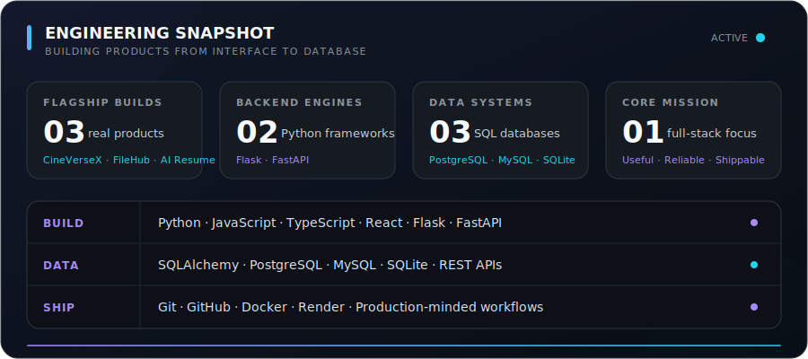

<!-- GitHub profile README for github.com/chevior -->

<div align="center">

<a href="https://github.com/chevior">
  
</a>

<p>
  <a href="https://github.com/chevior?tab=followers"></a>
  
  
</p>

### Building dependable web products from interface to database.

<p>
  I am an Information Science Engineering student focused on full-stack development,<br />
  Python backends, practical AI, and software that solves real problems.
</p>

<a href="#featured-projects">Projects</a> ·
<a href="#tech-stack">Tech Stack</a> ·
<a href="https://www.linkedin.com/in/chethan-n-500530310">LinkedIn</a> ·
<a href="mailto:nchethan066@gmail.com">Email</a>

</div>

---

## About Me

```python
chethan = {
    "role": "Information Science Engineering Student",
    "building": ["full-stack applications", "Python APIs", "practical AI tools"],
    "learning": ["system design", "Docker", "PostgreSQL"],
    "goal": "Grow into a software engineer who ships useful, reliable products",
}
```

- 🔭 Currently improving **CineVerseX**, **FileHub**, and **AI Resume Analyzer**
- 🌱 Deepening my knowledge of backend architecture, databases, and deployment
- 🤝 Open to internships, open-source work, and meaningful collaborations
- 💬 Ask me about Python, Flask, FastAPI, React, SQL, or building a project end to end

## Featured Projects

<table>
  <tr>
    <td width="50%" valign="top">
      <h3>🎬 <a href="https://github.com/chevior/CineVerseX">CineVerseX</a></h3>
      <p>A full-stack movie discovery and ticket-booking platform with authentication, theater and show management, seat selection, payments, tickets, analytics, and admin tools.</p>
      <p><code>Python</code> <code>Flask</code> <code>SQLAlchemy</code> <code>SQLite</code> <code>Bootstrap</code></p>
      <a href="https://cineversex.onrender.com"></a>
      <a href="https://github.com/chevior/CineVerseX"></a>
    </td>
    <td width="50%" valign="top">
      <h3>📄 <a href="https://github.com/chevior/AI-Resume-Analyzer">AI Resume Analyzer</a></h3>
      <p>A full-stack resume analysis platform with ATS scoring, skill extraction, actionable feedback, and a job-readiness dashboard.</p>
      <p><code>React</code> <code>JavaScript</code> <code>Flask</code> <code>Python</code></p>
      <a href="https://github.com/chevior/AI-Resume-Analyzer"></a>
    </td>
  </tr>
  <tr>
    <td width="50%" valign="top">
      <h3>☁️ <a href="https://github.com/chevior/FileHub">FileHub</a></h3>
      <p>A modern full-stack file-management application designed around a clean user experience and a maintainable TypeScript codebase.</p>
      <p><code>TypeScript</code> <code>Full Stack</code> <code>File Management</code></p>
      <a href="https://github.com/chevior/FileHub"></a>
    </td>
    <td width="50%" valign="top">
      <h3>🚀 What I Build</h3>
      <p>Production-minded portfolio projects with responsive interfaces, secure authentication, structured APIs, persistent data, and deployable workflows.</p>
      <p><code>Web Apps</code> <code>REST APIs</code> <code>AI Tools</code></p>
      <a href="https://github.com/chevior?tab=repositories"></a>
    </td>
  </tr>
</table>

## Engineering Snapshot

<div align="center">



</div>

<div align="center">
  <sub>A focused view of the technologies and product work behind my repositories.</sub>
  <br />
  <a href="https://github.com/chevior?tab=repositories">Explore the repositories</a> ·
  <a href="https://github.com/chevior?tab=overview">View contribution activity</a>
</div>

## Technical Toolkit

<div align="center">

### 💻 Programming Languages


<br />
<sub><b>Python</b> &nbsp;·&nbsp; <b>JavaScript</b> &nbsp;·&nbsp; <b>TypeScript</b></sub>

### 🌐 Web Foundations


<br />
<sub><b>HTML5</b> &nbsp;·&nbsp; <b>CSS3</b></sub>

### 🎨 Frontend Development


<br />
<sub><b>React</b> &nbsp;·&nbsp; <b>Vite</b> &nbsp;·&nbsp; <b>Tailwind CSS</b></sub>

### ⚙️ Backend & API Development


<br />
<sub><b>Flask</b> &nbsp;·&nbsp; <b>FastAPI</b> &nbsp;·&nbsp; <b>Postman</b></sub>

### 🗄️ Databases


<br />
<sub><b>PostgreSQL</b> &nbsp;·&nbsp; <b>MySQL</b> &nbsp;·&nbsp; <b>SQLite</b></sub>

### 🛠️ Development, Deployment & Design


<br />
<sub><b>Git</b> &nbsp;·&nbsp; <b>GitHub</b> &nbsp;·&nbsp; <b>Docker</b> &nbsp;·&nbsp; <b>VS Code</b> &nbsp;·&nbsp; <b>Figma</b></sub>

</div>

## Currently

<table>
  <tr>
    <td width="33%" valign="top">
      <h3>⚡ Shipping</h3>
      <p>Improving reliability, usability, and end-to-end workflows across my flagship projects.</p>
      <p><code>CineVerseX</code> <code>FileHub</code> <code>AI Resume</code></p>
    </td>
    <td width="33%" valign="top">
      <h3>🧭 Leveling Up</h3>
      <p>Going deeper into system design, containerization, PostgreSQL, testing, and production deployment.</p>
      <p><code>Docker</code> <code>Architecture</code> <code>DevOps</code></p>
    </td>
    <td width="33%" valign="top">
      <h3>🤝 Open To</h3>
      <p>Software engineering internships, open-source contributions, and thoughtful project collaborations.</p>
      <p><code>Internships</code> <code>Open Source</code> <code>Teams</code></p>
    </td>
  </tr>
</table>

## How I Work

```text
01  Understand the problem      →  Start with the user and the real constraint
02  Design the smallest system  →  Keep the architecture clear and maintainable
03  Build the complete flow     →  Connect interface, API, data, and deployment
04  Test, learn, improve        →  Treat every release as the next iteration
```

> I care about software that is useful first, understandable second, and impressive because it works.

## Let's Build Something Useful

<div align="center">

<p>
  Have an internship, open-source idea, or project worth building?<br />
  I would be glad to hear about it.
</p>


<br /><br />

<a href="https://github.com/chevior"></a>
<a href="https://www.linkedin.com/in/chethan-n-500530310"></a>
<a href="mailto:nchethan066@gmail.com"></a>

<br /><br />

<sub>Thanks for visiting · Bengaluru, India · Always learning, building, and improving</sub>

</div>
